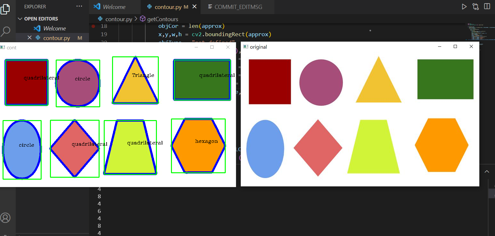

# openCv
This is a helper file/function which detects shapes in a given picture. Right now it only detects quadrilateral, circle , trianle and hexagon
but it can be very easily modified to detect various shapes on the basis of corner points and aspect ratio.

